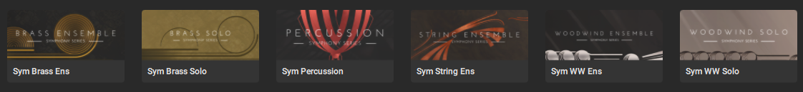
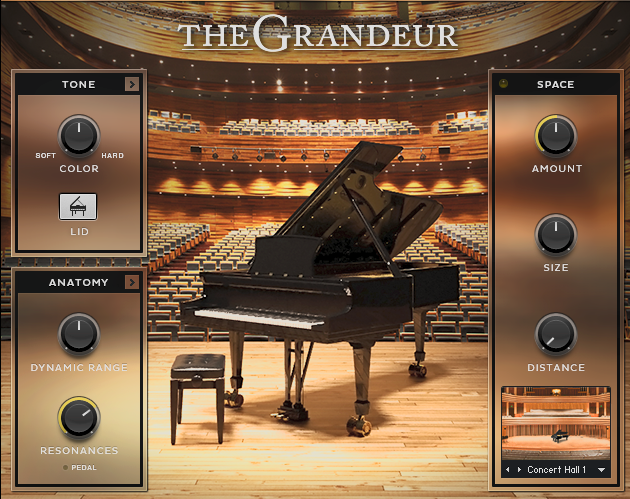

+++
title = '2 new VSTs'
date = 2025-07-02T23:09:54+02:00
draft = false
show_date = true
tags = ['ableton live', 'VST', 'music production']
archive = false
pinned = false
+++

Last week I bought two new VSTs during the summer sale of Native Instruments. Got some pretty good deals on them and I'm excited to play around with them and overall I'm trying to stick to my goal of practising music production more regularly.

## Symphony Series Collection

A collection of a bunch of classical instruments - brass ensemble, brass solo, percussion, string ensemble, woodwinds ensemble and woodwinds solo.

Overall I'm pretty happy with how it sounds, the solo ones don't blow me away but for the price I got it I can't complain. This means I finally am also able to play around with writing some classical stuff since Ableton doesn't offer a lot there out of the box.

## The Grandeur Piano

A piano VST - I'm actually suprised how nice it sounds and it's definitely an upgrade over the built in pianos in Ableton. Also has a bunch of nice presets and the common things like pedal noise and different rooms for reverb. You can even open or close the lid of the piano which affects the sound. And I'm going to be using this one also just for general piano practice, not exclusively for music production.