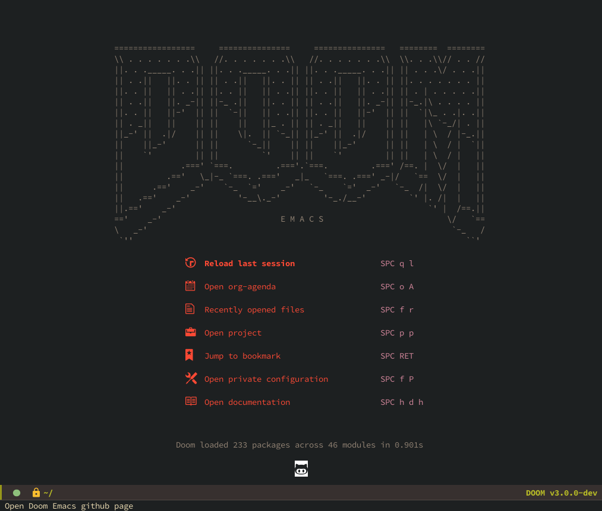

+++
title = 'Giving Doom Emacs a second try'
date = 2022-06-24T20:00:00+02:00
draft = false
show_date = true
tags = ['doom-emacs', 'programming']
archive = true
+++

After trying out Doom Emacs late last year and giving up on it, I've decided to give it another try.
<!--more-->

Due to not really having an interesting programming pet project, last year I decided to try out a bunch of different editors. I went from NeoVim to LunarVim and SpaceVim, but after becoming frustrated while trying to get a comfortable setup using these editors, I gave **Doom Emacs** a shot.



Out of the ones that I tried out, Doom Emacs definitely felt closest to being an editor that I could actually be productive with. However, after playing around with it and messing with the settings without giving it too much thought, I gave up on my new-editor-quest altogether.

I really like the idea of Emacs / Doom Emacs though because it can be used with keyboard only & it feels like I'd be able to really customise my editor a lot and, once I'd learn and get used to the most important keyboard shortcuts, I could actually be faster navigating and editing code than with a "normal" editor like VSCode for example.

## Setup 

I completely uninstalled my previous installation and deleted my old config files and installed Doom Emacs again from scratch. My current dotfiles for emacs can be found [here](https://github.com/matkv/dotfiles/tree/master/doom-emacs). I basically went through all those files and set some basic settings in the ```init.el``` file and set my font & theme in the ```config.el``` file. So far I'm not using any other packages than the ones that already are bundled with Doom Emacs.

## Next steps

I'm planning to watch the complete playlist of [DoomCasts](https://www.youtube.com/playlist?list=PLhXZp00uXBk4np17N39WvB80zgxlZfVwj) (maybe I'll skip the org-mode part because I'm not really planning on using that). 

Other than that, I'm also going to be trying to use Doom Emacs as more or less my main editor so that I get more practice with it. I currently have some issues getting the Rust debugger to work correctly, but for the other languages I'm using it should be good to go. This way I'll hopefully have a more gradual progress and won't mess up my config files by messing with random settings but actually make more conscious choices when it comes to that.

