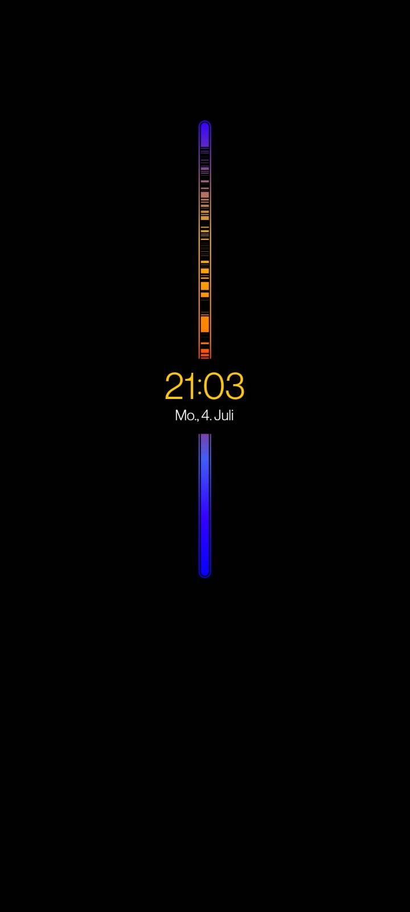

+++
title = 'Digital Minimalism'
date = 2022-07-04T20:00:00+01:00
draft = false
show_date = true
tags = ['minimalism']
toc = true
+++

Some thoughts on Digital Minimalism and my plans on how I am going to try to (hopefully) embrace this mindset a bit more in my personal life and be more mindful about my technology use.

<!--more-->

I'm currently reading [Digital Minimalism](https://www.calnewport.com/books/digital-minimalism/) by Cal Newport because I've been interested to cut down my phone usage in general. So I thought I'd write a blog post about my plans and general ideas on how I want to want to achieve that.

## Decluttering my phone

As my first step I decided to clean out my phone & uninstall all the apps that I found are unnecessary and taking up too much of my time or giving me too many notifications & distractions throughout the day.

While I removed some apps like Twitch or Discord that would often interrupt me, I still haven't managed to make myself uninstall Reddit because it's my go-to app when I'm bored to be honest.

I also set up the "always-on-display" on my phone to show me this sort of activity view that interrupts this colorful bar whenever you unlock and use your phone. So the more black space you have in this bar, the more you've been using your phone throughout the day.

The idea is that this will maybe just give me a little more incentive to not unlock my phone unless it's actually necessary.

## Analog note-taking

Another idea that I've had is to try and move most of my note-taking to a paper notebook that I carry with me in my pocket. I've been carrying a little Moleskine notebook for more than a year now. So far I've been using it for random notes, shopping lists and to-do items and I want to really put more effort into using it more.

Maybe I'll even look into [Rapid Logging](https://medium.com/ninja-writers/keep-it-simple-make-bullet-journaling-work-for-you-64ed29057dd4) in order to be more efficient with my note taking & have an easier time keeping track of notes over multiple days.

Then every night, I could transfer the most important notes back to my **Obsidian vault** in order to have them backed up and searchable.

## Computer-only apps

I've also decided to move some apps off my phone and use them exclusively on my computer instead. Two examples are as mentioned above **Twitch** and **Discord**. I don't really need either app on my phone. Discord is something I mostly use when it comes to gaming which I do exclusively on my computer and Twitch just seems like an app that can easily distract me on my phone while I don't necessarily mind having it open on a second screen on my computer while I'm doing something else.

## Reading instead of random scrolling

Reading has been a huge hobby for me throughout my life and now that I got a Kindle in 2018 I've been taking it a lot more seriously again.

By cutting down on random scrolling, I'm hoping to spend more time reading something I'm actually enjoying rather than just wasting time looking at random stuff online, for example on Reddit.

## One screen at a time

I'm also going to try and stick to looking at only one screen at a time. So for example if I'm watching a movie, I want to focus specifically on that without taking my phone out every now and then. Same goes for YouTube videos or while I'm reading.

## Spending some time without screens every day

Lastly, I want to make it a conscious habit to spend some time away from screens every day.

I'm already looking at a monitor for more than 8 hours per day during work and then obviously still a lot in my free time so I'm going to set a rule for myself to get away from any screens for a little bit every day.
For example I could use my workouts as an easy way to make that happen & on rest days I could still go for a walk and either leave my phone at home or just use it to play an audiobook or music without actually taking it out of my pocket.

This post was mostly rambling but I feel like it helped to organize my thoughts about this topic. Let's see how well I'll actually be able to stick to my new goals.