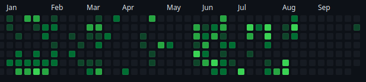

+++
title = 'Downgrading Neovim to a simple text editor'
date = 2023-09-29T18:00:00+01:00
draft = false
show_date = true
tags = ['neovim']
+++

Why I've decided to give up on trying to use Neovim as my main IDE and how I'm planning to use it in the future instead.
<!--more-->
I now haven't worked on any pet projects as far as programming is concerned since early August - as you can see my commit graph on GitHub has been pretty empty recently. 

In part, this is due to the fact that over the summer I'm generally spending less time in front of the computer, but mainly it's that I've just lost motivation to work on anything after getting a bit burnt out on trying to get a nicely working Neovim setup for Rust, Go & C# programming.

Especially the latter has been a pain to set up and at some point I noticed that I'm spending more time messing with my editor than actually writing code and improving my programming skills - so I just grew tired of it and stopped working on anything at all for several weeks.

LazyVim has been pretty great and while I was able to get most of the stuff that I needed to work up to like 80% or so, there were little things here and there that I couldn't make work the way I wanted to. While I enjoy tinkering to a certain extent, at some point it just started to feel like I was spending too much time to achieve things in Neovim that I would get out of the box with other editors (Debugging being one of the bigger examples). I understand that other's might have other usecases and needs and that Neovim might be a perfect fit for them, but I can now say that I've given Neovim (and Emacs previously) an honest shot, but for an actual IDE, it is just not for me.

So I've made the decision to give up on trying to use Neovim as my main IDE - I'll be going back to VSCode - but instead I'm going to set it up to be just a fast & comfortable to use text editor, not specifically for writing code.

## Things I loved about Neovim

I'm not going to stop using Neovim - there are a lot of things about it that I love and I'm definitely planning to keep using.

- Speed - I don't think I need to explain that one
- Keybindings - I've gotten very used to the keybindings, I'm using them in Obsidian, I'm using them at work in Visual Studio with the VSVim extension and I'm planning to try & set them up in VSCode as well
- Customizabilty - I can change every little thing I want (this can however also lead to getting distracted and messing around with the editor instead of actually working)
- Plugins - some plugins have really improved my workflow, for example there's an Obsidian plugin for Neovim that makes navigating a Obsidian vault really comfortable, or just small plugins like Zenmode that remove distractions when working on a single file + obviously the endless theming options in Neovim
- Fuzzy finder & grep - probably the feature I miss the most in a lot of other editors, it's just so fast find files and navigate to them.
- Leap.nvim - a very intuitive (at least for me) way to jump to any part in a file super quickly, basically removes any need to use the mouse and is something I keep doing by mistake in other editors because it just feels right
- Lazy.nvim - very easy way to keep everything in Neovim up to date

### What I want to use Neovim for

- **not** an IDE - I will be removing all the plugins and customization that were specific to getting some language working in Neovim
- a fast and as minimal as possible text editor for day to day notes, especially in Obsidian
- having clean and simple dotfiles and set it up as a long term text editor that will feel comfortable to use for years (so I need to really clean up my dotfiles for Neovim again)

### What I want to use VSCode for

- my main IDE - get a nice set up for my most used languages going again, including snippets, debugging and everything else I expect from a modern IDE
- set up vim keybindings in VSCode - really put effort into making them work nicely (I need to check out several extentions and decide what I want to go for)
- overall look into what extensions are popular these days and decide if they make sense for me
- set up my dotfiles for VSCode again and maintain them

