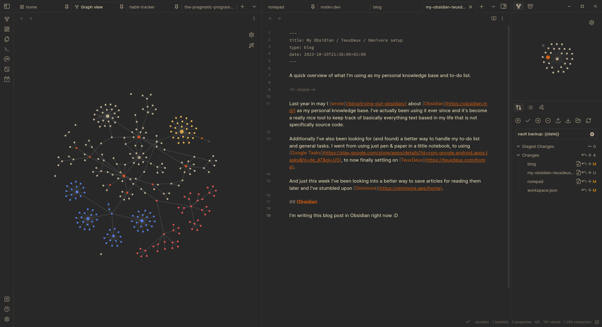
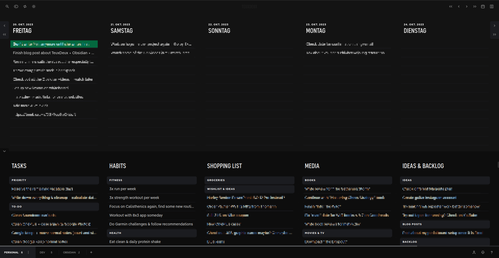

+++
title = 'My Obsidian / Teuxdeux / Omnivore setup'
date = 2023-10-20T19:00:00+02:00
draft = false
show_date = false
tags = ['obsidian', 'teuxdeux', 'omnivore', 'software', 'tools']
+++
A quick overview of what I'm using as my personal knowledge base and to-do list.

<!--more-->

Last year in may I [wrote](/trying-out-obsidian/) about [Obsidian](https://obsidian.md/) as my personal knowledge base. I've actually been using it ever since and it's become a really nice tool to keep track of basically everything text based in my life that is not specifically source code.

Additionally I've also been looking for (and found) a better way to handle my to-do list and general tasks. I went from using just pen & paper in a little notebook, to using [Google Tasks](https://play.google.com/store/apps/details?id=com.google.android.apps.tasks&hl=de_AT&gl=US), to now finally settling on [TeuxDeux](https://teuxdeux.com/home).

And just this week I've been looking into a better way to save articles for reading them later and I've stumbled upon [Omnivore](https://omnivore.app/home).

## Obsidian

Obsidian has become one of my most used pieces of software these days. I've moved basically any type of text-based documents into my Obsidian vault. A week or two ago I finally made the leap to buy Obsidian Sync - and I don't regret it so far (even though the price can be considered a bit steep at roughly 8$ per month when buying the yearly subscription).

But now that I am able to comfortably use it on my phone too I've been getting even more into it. I'm currently looking into more ways to improve my workflow in Obsidian and checking out some additional plugins - but the main selling point for me is just having a comfortable way to manage **all of my notes in one place** and not necessarily needing to worry about subfolders and where I'm putting my notes exactly. I can just create them and link them by topic instead.

There's also endless ways to customize it, I can use templates (for example for book reviews, journal entries, blog posts for this website) and it's overall also just a great markdown editor.

My main uses for Obsidian are:

- **day to day notes** -> I just have a "notepad" file where I jot down what's going on, things I want to remember, basically anything that crosses my mind and I want to record
- **journal** -> I've been trying to get back into journaling regularly, decided to go the digital route now so Obsidian has been very comfortable, especially now that I can create journal entries on my phone too. Currently I just have one note per week and notes for each month & year. A separate note for each day just got too messy and felt like overkill because most days I don't write a whole lot anyways
- **book reviews** -> I have a template for book reviews that I use for this website and I also copy the content of them into Goodreads usually
- **programming notes** -> I usually take notes when learning a new programming language

And of course just basically any other topic I can think o - **if it's text based, it goes into Obsidian**.

## TeuxDeux

As I said, for a while I moved all of my notes & to-do list to an actual paper notebook. I loved the aspect of just writing down all the things I want to get done today and be able to tick them off. However there were always two big downsides to doing this the analog way:

- having to manually move tasks from one day to the next
- difficult to track appointments and tasks for specific dates across multiple pages

[TeuxDeux](https://teuxdeux.com/home) basically solved this problem completely for me. It is genuinely **pretty much perfect** for the way I'd like to handle my to-do list.

Excuse the pretty heavy censoring - but I don't want to share all my tasks on it publicly :D But TeuxDeux has been such a great tool over the recent months. I love the way the layout works: you have your calendar view at the top, and at the bottom you have custom lists. So for each day I can **drag and drop** the tasks I want to tackle this day and any tasks that are left over at the end of the day are automatically moved to the next one.

It might look pretty minimal & simple, but that's pretty much why I prefer it over other to-do apps. The only thing that it's missing in my opinion would be the option to actually get **reminders & notification for tasks** - but generally the calendar view makes up for it because I can see upcoming tasks at least a couple days in advance. And long term appointments go into my calendar anyways, not my to-do list.

You can format the tasks with some markdown options, you can create subheaders and create repeating tasks. Overall this feels closest to what I would be doing with pen and paper - but without any of the downsides.

I'm working with several categories so I can handle the majority of what I have to do just by looking at this first screen - but you could create a lot more sub-pages and you even have tabs at the bottom that let you organise these lists in more detail. I have lists for general tasks that don't have a specific date, one list for my habits (mostly just to keep them in mind - these don't really get ticked off), one for shopping lists (groceries and long-term "wish lists"), one for media in general (books, movies/tv, games - basically any kind of tasks concerning these topics) and one for general ideas and low priority tasks.

And on the other two tabs I have one group of task-lists for software development in general (projects I'm working on, ideas, changes to my setup), and for now I have another list for things I want to change and improve in Obsidian. It's just really nice to be able to separate different types of tasks so I don't get overwhelmed and lose track of what's important.

Generally I'm managing and organising the tasks mostly on the web app, and the mobile app is just for actually ticking off tasks during the day.

I absolutely love TeuxDeux - the web app is actually not free, there's a yearly subscription but considering how much I'm using this every day it is absolutely worth it for me.

## Omnivore

This is actually a tool that I've just started using recently. For a while I've been using [Pocket](https://www.mozilla.org/en-US/firefox/pocket/) by Firefox as my "save for reading later" app - but a week or two ago I stumbled across [Omnivore](https://omnivore.app/) on Hackernews.

The main things that made me give it a shot were the fact is **completely free (NO paid options at all for now)**, **open source** and that you can sign up with just email/password, you're not forced to use your Google account or something similar like with many other similar apps.

And: it has an official [Obsidian plugin](https://github.com/omnivore-app/obsidian-omnivore) that let's you import saved articles as nicely formatted markdown notes in Obsidian. You can specify exactly how you want the note to look, where you want it to be saved and what content should be shown - directly in the plugin settings in Obsidian.

So now I can comfortably move any article I find online into Obsidian with just one click - copy the specific parts of the article into some other note in Obsidian - and then just delete the auto generated note. From what I've seen so far while trying it out, notes that were synced once and then deleted or archived are **not** synced again, so my Obsidian vault won't get cluttered with old articles from Omnivore.

I still need to play around with this more (and there is the overall question how Omnivore wants to sustain it's business - I guess they'll have to add some paid features in the long run, hopefully things that just give you additional benefits and don't downgrade the current experience. Then again, there is the option to [self host your own Omnivore instance](https://blog.omnivore.app/p/deploying-a-minimal-self-hosted-omnivore) which could be an option if they ever start asking for money to use their own hosted version). But from a first look, it seems pretty great. I love the Obsidian integration, and the mobile & web app work fine and let you save articles with just one click and read them in there as well. Pretty happy with it.

