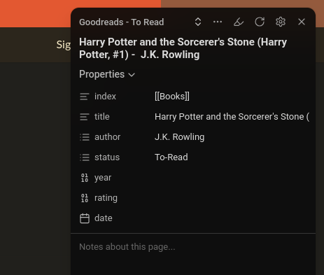
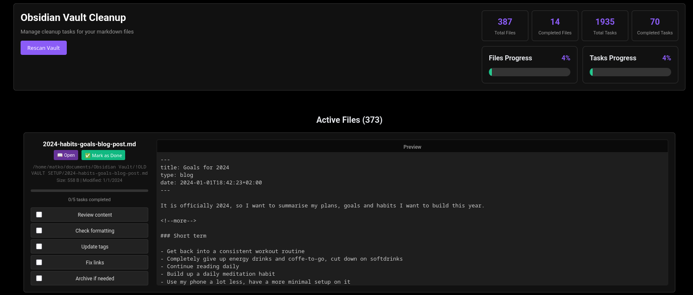

+++
title = 'Obsidian Restructuring'
date = 2025-09-20T13:10:49+02:00
draft = false
show_date = true
tags = ['obsidian', 'knowledge management']
archive = false
pinned = false
+++

I've now been using [Obsidian](https://obsidian.md) for more than [3 years](https://matkv.dev/trying-out-obsidian/) and during that time I've been building on top of the same vault as the one that I created initially when trying it out.

Now that Obsidian finally introduced [Bases](https://help.obsidian.md/bases) - basically a way to view notes as a "database" that using the yaml properties inside each note - I've decided to give my whole setup a long overdue overhaul and re-think how I want to structure my vault.

This post is supposed to explain my ideas for this re-structuring and should be a guide & to-do for myself while working on this.

## General changes

- changing the file naming scheme from titles like "obsidian-restructuring" to more normal filenames like "Obsidian Restructuring"
- having a more simplified main folder structure - I'm trying to use only a limited amount of folders & sub-folders while still having enough of them to keep my notes organized. Instead of relying on folders, I'm trying to use tags more (I've previously not used them at all) to add a note to multiple "topics" at once
- a more simplified default template, just consisting of "description" and "tags" fields & separate templates for my books base and the posts for this site
## Main folder structure

- **Archive** - no longer relevant notes
- **Database** - the files for my bases & index pages
- **Inbox** - a place to capture new notes before moving them to the correct spot & my "Notepad" scratchpad file
- **Journal** - my weekly journal files
- **Notes** - the "main" notes folder, most of the content is in here
	- **matkv.dev** - blog posts for this website
- **Obsidian**
	- Attachments
	- Templates
	- Web Clipper Templates
## Bases

Instead of relying on folders, I'm using bases to group my notes together and display lists / MOCs of them. I then just have a file called "Home" in which I'm showing different views of all my bases. But this is generated automatically so I don't have to manually link or edit anything.

I have already set up a couple of bases:

- Archive
- Books
	- This contains my "To-Read" list and already finished book reviews
	- The base is created just by filtering for the "Database/Index/Books" folder - that's where the actual files for each books are.
	- In order to still have them connected in the Obsidian graph, the default book template has an "Index" property which just links to an index file in the same folder as the books base. So this way I don't have to manually remember linking the note - it happens automatically when creating any book note.
	- In the "Home" file I then have one view that filters the base to only show books with the status "To-Read" and one that shows the ones with the status "Finished"
- Gaming
	- This just shows all notes with the "#gaming" tag, no filtering based on folders
	- Generally this just means that I have one note per game that I'm currently playing
- Inbox
	- All notes in the "Inbox" folder
- matkv.dev
	- All notes for this website, also just filtered for a specific directory and I also have an index file for this so the graph looks nicer
- Notes
	- My "normal" notes - if a note is not in any of the categories above, it's just a normal note that can be anywhere and linked to any other note. This is basically the main type of notes in my vault
- Web Clippings
	- Any note captured with the [Obsidian Web Clipper](https://obsidian.md/clipper) lands here

## Obsidian web clipper

I finally set up the web clipper extension and it is actually working really nicely with the bases. For now, I have two templates for the web clipper. One let's me add books to my "To-Read" list in the books base with just one click. I just need to **open any book on Goodreads & click on the web clipper icon** - it automatically figures out I'm on Goodreads and picks the correct template and fills out some basic info that it "scrapes" from the web page. The note is placed in the correct folder and the index is set correctly.

This makes it very quick to add new books to the vault. I'm planning to probably set up the same for IMDB to quickly add movies to my watchlist.

For normal clippings it selects the basic web clipper template and I usually edit it directly a bit before adding it to the vault.

Overall this looks promising, the extension also works on Firefox mobile so I can use it on my phone - even though I wish it would be maybe possible to directly share a website to the Obsidian app and it would behave the same way as the clipper.

## Vibe coded helper app

Considering I have to go through around 500 files in my old vault, I decided to try "vibe-coding" a little helper app to keep track of everything. I didn't want to build anything myself since this would really be a one-time thing. This could have probably just been an Excel file but I think it was better to spend two hours arguing with GitHub Copilot to build a little Go web app :) 

This is what it looks like:

This was actually the first time I tried to build something without writing a single line of code - worked out relatively well and it's good enough for a one-time project. 