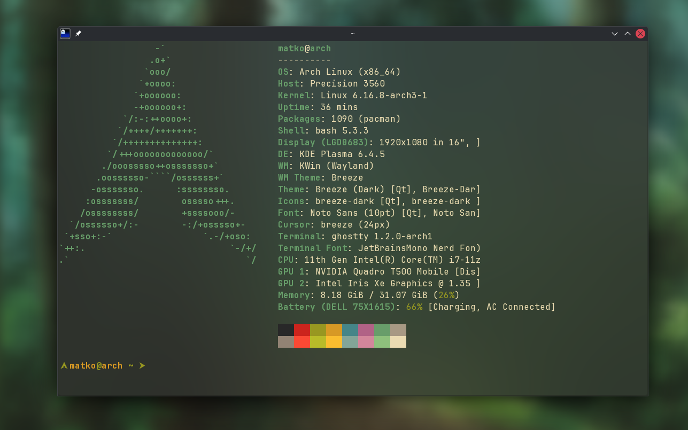

+++
title = 'Trying Out Ghostty & Github Copilot CLI'
date = 2025-09-30T19:09:41+02:00
draft = false
show_date = true
tags = ['ghostty', 'github-copilot', 'tools']
archive = false
pinned = false
+++

## Ghostty

I decided to give [Ghostty](https://ghostty.com) another shot after my first try back when it came out. Initially I was kind of turned off by the fact that it's based on GTK when running it on Linux so it doesn't really look native on KDE.

But in the meantime they at least changed the titlebar to look nice on QT (KDE), and since I'm not really using the tab functionality directly in Ghostty since i use [Zellij](https://zellij.dev) for that, it actually does everything I need it to do. I don't really see any killer feature yet that would differentiate it from WezTerm for my personal usecase - but then again I'm not really using any advanced features in WezTerm either.

It's possible that there's some small issue with the column length for fastfetch, haven't really checked that yet.

## GitHub Copilot CLI

Another tool that I just started playing around with is [GitHub Copilot CLI](https://docs.github.com/en/copilot/concepts/agents/about-copilot-cli). I've already been using GitHub Copilot in VS Code and Visual Studio for like a year now, both with a personal subscription and at work, but this allows you to run it directly in the terminal.

It asks for permission to run any commands and you can set which working directories it has access to. It's been pretty cool to just have it do some annoying or tedious tasks without needing to interact with it a lot. And since in most projects i track everything with Git anyways I'm not too worried about messing something up without being able to revert any changes.

Just earlier today I had it create a PWA for [TeuxDeux](https://teuxdeux.com) on KDE even though Firefox doesn't officially support it yet on Linux.  It has been pretty cool to see it actually try and look up things like the icon for it online and it tried out a couple KDE specific commands to have the app show up in the application menu. Pretty impressive - I probably wouldn't have bothered to make it work myself.

Overall I want to play around with it more but it seems like this opens up the usecases for Copilot quite a bit more for me.
