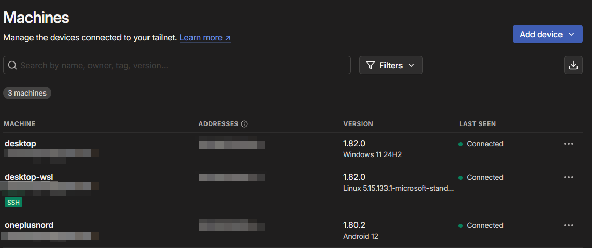

+++
title = 'Trying Out Tailscale'
date = 2025-04-10T20:51:03+02:00
draft = false
show_date = true
tags = ['tailscale', 'tools']
archive = false
pinned = false
+++
I've been interested in trying out [Tailscale](https://tailscale.com/) recently - it is a tool that allows you to set up a secure network between your personal devices. This allows you to access them from anywhere as if they are on the same local network.

One of the main usecases for me would be to be able to access my dev projects on my phone while I'm working on them on my Windows desktop or within WSL Arch Linux. That way I can test this website or other web based projects on my phone without having to actually publish them anywhere.



Down the line I might also try to set it up on my Raspberry Pi so I can run some tools/services 24/7 and access them while not in my home network.

The setup was not completely straightforward in my case but I managed to get it working pretty well.

Installing Tailscale on Windows & Android was pretty easy, on Arch Linux in WSL i had to play around a bit.

## Installation on Arch Linux in WSL

1. Install tailscale using `pacman`:
   ```bash
   sudo pacman -S tailscale
   ```
2. Start the Tailscale daemon:
   ```bash
   sudo tailscaled
   ```
3. Authenticate your device (just the first time):
   ```bash
   sudo tailscale up
   ```
4. Enable SSH (only possible on Linux)
   ```bash
   sudo tailscale up --ssh
   ```

Once that is done, I can access my WSL instance from my phone or Windows directly.

```bash
ssh matkv@MY_TAILSCALE_IP
```

The only prerequisite is that tailscale is running on the device I want to access. On Linux that means the daemon has to be running.

I made a little alias to start the daemon in WSL:

```bash
alias start-tailscale="sudo tailscaled"
```

## Acessing my hugo site and the start project through Tailscale

In order to access those projects from Tailscale (so for example from my phone) I need to start them a bit differently.

Starting the "start" project:

```bash
npm run dev -- --host 0.0.0.0 --port 3000
```

Starting the hugo server:

```bash
hugo serve --bind=0.0.0.0 --port=1313
```

This way I can access the projects from my phone using the Tailscale IP of my WSL instance.

## Additional setup

In order to make working with this easier, I created a couple of bash aliases:

```bash
alias start-tailscale="sudo tailscaled"
alias tailscalehugo="hugo serve --bind=0.0.0.0 --port=1313"
alias tailscalestartproject="npm run dev -- --host 0.0.0.0 --port 3000"
```